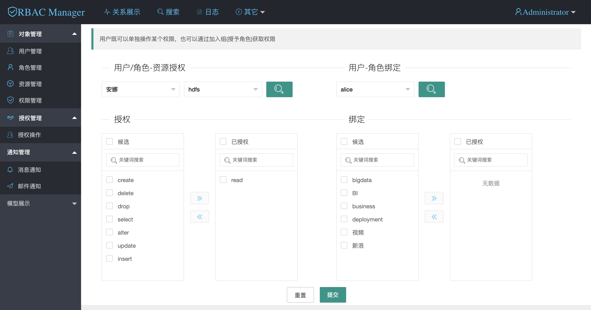
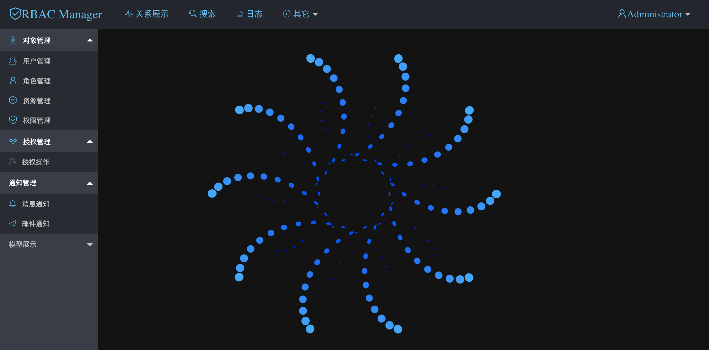

# RBACManageSystem
## 简介

基于 casbin、RBAC 概念的权限管理系统

## 进度

初步完成RBAC策略管理，

## 下一步

1. Admin 策略
1. dao唯name一约束
1. 资源和权限表之间解耦合及约束关系
1. 用户和组展示加前缀
1. enforce API 外漏

## 部署
### 获取

```$xslt
git clone https://github.com/zhfk/RBACManageSystem.git
```
### 配置 application.yml mysql

```$xslt
  datasource:
    url: jdbc:mysql://xxxxx:3306/xxxx?characterEncoding=utf8&characterSetResults=utf8&autoReconnect=true&failOverReadOnly=false
    username: xxxx
    password: xxxx
```
配置项：

    - host
    - database
    - username
    - password
    
### mysql


```
./gradlew bootJar
java -jar xxx.jar
```
## 访问

[localhost:8888](localhost:8888)

首页:


授权页:


## 遇到的问题
用jar包启动缺少model.conf文件？
```$xslt
这是由于casbin本身代码设计缺陷，可能是作者没有考虑到在jar包中资源文件定位问题
解决办法:
    java -Dspring.casbin.model=/path/to/model.conf -jar xxx.jar
    用jvm -D参数指定变量就可以了
```


